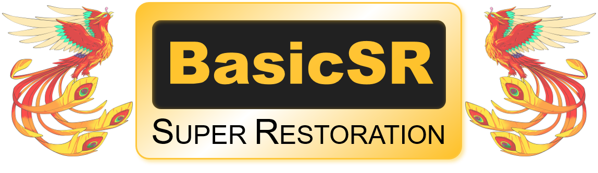

<p align="center">
  
</p>

<div align="center">

[](https://github.com/xinntao/BasicSR/blob/master/LICENSE.txt)
[](https://pypi.org/project/basicsr/)
[](https://lgtm.com/projects/g/xinntao/BasicSR/context:python)
[](https://github.com/xinntao/BasicSR/blob/master/.github/workflows/pylint.yml)
[](https://github.com/xinntao/BasicSR/blob/master/.github/workflows/publish-pip.yml)
[](https://github.com/xinntao/BasicSR/blob/master/.github/workflows/gitee-mirror.yml)

</div>

<div align="center">

⚡[**HowTo**](#-HOWTOs) **|** 🔧[**Installation**](docs/INSTALL.md) **|** 💻[**Training Commands**](docs/TrainTest.md) **|** 🐢[**DatasetPrepare**](docs/DatasetPreparation.md) **|** 🏰[**Model Zoo**](docs/ModelZoo.md)

📕[**中文解读文档**](https://github.com/XPixelGroup/BasicSR-docs) **|** 📊 [**Plot scripts**](scripts/plot) **|** 📝[Introduction](docs/introduction.md) **|** <a href="https://github.com/XPixelGroup/BasicSR/tree/master/colab"></a> **|** ⏳[TODO List](https://github.com/xinntao/BasicSR/projects) **|** ❓[FAQ](docs/FAQ.md)
</div>

---

BasicSR (**Basic** **S**uper **R**estoration) is an open-source **image and video restoration** toolbox based on PyTorch, such as super-resolution, denoise, deblurring, JPEG artifacts removal, *etc*.<br>

**Since BasicSR has not been updated for some time, I have fixed some codes to support PyTorch2.0 and DDP training.**

🚩 **New Features/Updates**

- ✅ March 23, 2023. Support PyTorch2.0 Accelerate training by `torch.compile()`.
- **[More](docs/history_updates.md)**
---

## ⚡ Main Changes

- Mainly change [base_model](basicsr/models/base_model.py), [sr_model](basicsr/models/sr_model.py) to support PyTorch2.0 DDP training.
- For `torch.compile()`, please set `compile=true` in the option file. See [option for RRDB](options/train/ESRGAN/train_RRDBNet_PSNR_x4.yml) for details and use.

## ✨ Training Commands

### Single GPU Training

> CUDA_VISIBLE_DEVICES=0 \\\
> python basicsr/train.py -opt options/train/ESRGAN/train_RRDBNet_PSNR_x4.yml

### Distributed Training

**8 GPUs**

> CUDA_VISIBLE_DEVICES=0,1,2,3,4,5,6,7 \\\
> ./scripts/dist_train.sh 8 options/train/ESRGAN/train_RRDBNet_PSNR_x4.yml<br>

**It should work well on the server with 8 RTX 4090s.**

## 📜 License and Acknowledgement

This project is released under the [Apache 2.0 license](LICENSE.txt).<br>
More details about **license** and **acknowledgement** are in [LICENSE](LICENSE/README.md).<br>
Thanks for the contribution of [BasicSR](https://github.com/XPixelGroup/BasicSR)!

## 🌏 Citations

If BasicSR2.0 helps your research or work, please cite BasicSR2.0.<br>
The following is a BibTeX reference. The BibTeX entry requires the `url` LaTeX package.

``` latex
@misc{basicsr,
  author =       {Xintao Wang and Liangbin Xie and Ke Yu and Kelvin C.K. Chan and Chen Change Loy and Chao Dong},
  title =        {{BasicSR}: Open Source Image and Video Restoration Toolbox},
  howpublished = {\url{https://github.com/XPixelGroup/BasicSR}},
  year =         {2022}
}
```

``` latex
@misc{basicsr,
  author =       {Hao Li},
  title =        {{BasicSR2.0}: Open Source Image and Video Restoration Toolbox},
  howpublished = {\url{https://github.com/House-Leo/BasicSR2.0}},
  year =         {2023}
}
```


## 📧 Contact

If you have any questions, please email `lihao@njust.edu.cn`.
